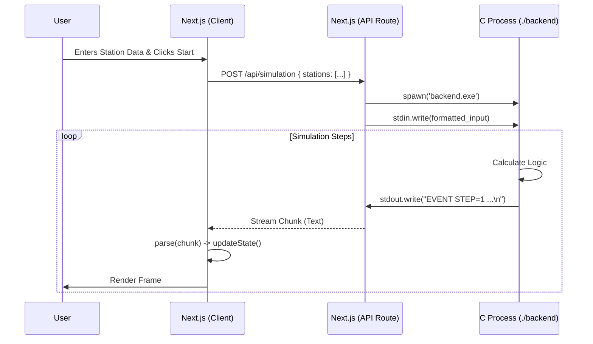

# Intelligent Transport System (ITS) - System Architecture & Codebase Deep Dive

> [!CAUTION]
> **Warning: Extreme Detail Ahead.**
> This document explains the codebase at a molecular level. It assumes zero prior knowledge of the project but requires understanding of C pointers, memory management, React hooks, and asynchronous JavaScript.

---

## 1. High-Level Architecture

The system operates on a **Client-Server** model, but with a twist: the "Server" is a local C process spawned by the Client's API route.



---

## 2. Backend Subsystem (C)

**Location**: `/backend`
**Compiler**: GCC (MinGW/Linux)
**Standard**: C99

The backend is a **deterministic finite state machine**. It does not use threads. It runs in a single loop until the simulation ends.

### 2.1 `main.c`
The entry point.
*   **Functionality**:
    1.  Prints a welcome message (ignored by frontend parser, but good for debug).
    2.  Calls `start_simulation()` from `simulation.c`.
    3.  Returns `0` (Success).

### 2.2 `simulation.c` - The Brain
This file contains the entire business logic. It is monolithic by design to keep state localized and performance high.

#### 2.2.1 Global State (Static Memory)
The simulation uses `static` arrays (fixed size) to avoid `malloc/free` overhead and memory leaks.

*   `int graph[6][6]`: **Adjacency Matrix**.
    *   `graph[i][j] = Distance`.
    *   `0` implies no direct connection.
    *   **Hardcoded Topology**:
        *   S0 -> S1 (15km), S0 -> S2 (25km)
        *   S1 -> S2 (20km), S1 -> S3 (20km)
        *   S2 -> S4 (20km)
        *   S3 -> S4 (15km), S3 -> S5 (20km)
        *   S4 -> S3 (15km)
    *   *Note*: This represents the physical road network.

*   `Station stations[6]`: **State Array**.
    *   Each index `i` maps to Station `Si`.
    *   `stations[i].waiting`: Mutable integer. The number of people currently at the bus stop.
    *   `stations[i].drop`: Mutable integer. The number of people whow *want* to go to this station (from the initial input). *Correction*: In the current logic, `drop` is actually treating as "How many people want to get off HERE". Input `drop` at S0 means people AT S0 want to get off AT S0? *Clarification*: The input logic `scanf` takes pairs. The user inputs "Wait" and "Drop". In the logic `if (s->drop > 0)`, it means if the station *expects* drops.
    *   *Critical Logic Note*: The simulation assumes `drop` is a property of the *Station* (demand to get off there), not the *Passenger*.

*   `HeapNode heap[6]`: **Priority Queue Array**.
    *   Used to sort stations by `waiting` count.
    *   `heap[0]` is always the station with the most people waiting.

*   `Route routes[3]`: **Path Definitions**.
    *   `R1`: S0->S1->S3->S5 (North Path)
    *   `R2`: S0->S2->S4->S5 (South Path)
    *   `R3`: S0->S1->S2->S4->S5 (Zig-Zag)

#### 2.2.2 Function: `heapify(int i)` & `build_heap()`
Implements a Standard **Binary Max-Heap**.
1.  `build_heap` copies `stations[i].waiting` into the `heap` array.
2.  It iterates backwards from `size/2 - 1` down to `0` calling `heapify`.
3.  Each `heapify` bubbles down the smaller value to maintain the Max-Heap property.
4.  *Why re-build every step?* Because passenger counts change dynamically (boarding/deboarding). An incremental update would be complex (decrease-key), so a full rebuild (O(N)) is faster for N=6.

#### 2.2.3 Function: `start_simulation()` - The Core Loop
The execution flow is strictly sequential:

**Phase 1: Input Parsing**
```c
for (i = 0; i < STATIONS; i++) {
    scanf("%d %d", &stations[i].waiting, &stations[i].drop);
}
```
*   It blocks waiting for 6 lines of input from `stdin`.
*   If `scanf` returns `< 2` (malformed input), it defaults to 0.

**Phase 2: Route Selection (Greedy)**
*   It loops through `routes[0..2]`.
*   Calls `calculate_score(route)`: Sums `stations[sid].waiting` for all *intermediate* stops.
*   Picks the route with the highest score.
*   *Output*: Prints `ROUTE_SELECTED ...` to stdout. This tells the frontend which path to highlight.

**Phase 3: Initialization**
*   `Bus bus1`: Stack allocated struct.
*   `bus1.route = selected.path`: Copies the path.
*   `bus1.passengerIDs`: Initializes a zeroed array of size 100 (`BUS_CAPACITY`).
*   `next_passenger_id = 101`: Counter for generating P101, P102, etc.

**Phase 4: Time Step Loop (`while step < 30`)**
Every iteration represents one atomic time unit.

1.  **Check Completion**: If `currentIndex >= routeLength`, break.
2.  **Get Current Context**:
    *   `sid = bus1.route[currentIndex]`: Where is the bus *now*?
    *   `Station *s`: Pointer to the current station object.
3.  **Deboarding (The "Drop" Logic)**:
    *   Condition: `if (s->drop > 0 && bus1.passengers > 0)`
    *   `flow_drop`: Min(people waiting to drop, people on bus).
    *   **Memory Move (`memmove`)**:
        *   This is the critical "Queue" behavior inside the array.
        *   Unlike a simple logical counter decrement, we physically shift the array.
        *   Example: `[P101, P102, P103]`. dropping 1.
        *   `memmove(dest=index 0, src=index 1, size=2 ints)`.
        *   Result: `[P102, P103, P103]`.
        *   Tail Clean: `bus1.passengerIDs[2] = 0`. Final: `[P102, P103]`.
    *   *Effect*: Passengers effectively "board at back, deboard from front".
4.  **Boarding (The "Wait" Logic)**:
    *   Condition: `sid != 5` (Can't board at final destination).
    *   `flow_board`: Min(people waiting, empty seats).
    *   Loop `k=0 to flow_board`:
        *   `bus1.passengerIDs[current_count + k] = next_passenger_id++`
        *   This fills the array `[..., P104, P105]`.
    *   *Effect*: New passengers are appended to the *end* of the list.
5.  **Event Emission**:
    *   Calls `emit_event(...)` passing the *entire* state.
6.  **State Maintenance**:
    *   `build_heap()`: Updates the congestion heap based on the new `waiting` counts (after boarding).
    *   `bus1.currentIndex++`: Moves the bus to the next node for the *next* step.
7.  **Increment Step**.

### 2.3 `events.c`
*   **Function**: `emit_event`
*   **Format**: `EVENT STEP=X BUS=Y ... PASSENGERS=A,B,C`
*   **Critical Detail**: `fflush(stdout)`.
    *   Standard Interface (stdio) usually buffers output until a newline *and* a certain buffer size (4KB) is reached.
    *   Since our simulation is slow/step-based, we *must* force the OS to send the data to the pipe immediately.
    *   Without this, the frontend hangs for 10 steps and then receives 10 steps at once.

---

## 3. Frontend Subsystem (Next.js)

**Location**: `/frontend`
**Framework**: Next.js 14 (App Router)
**Styling**: Tailwind CSS

The frontend is an **Event Stream Processor**. It essentially "plays back" the log file generated by the backend, but does it in real-time.

### 3.1 `hooks/useSimulation.js`
This file allows the frontend to be "Reactive".

#### 3.1.1 `startSimulation()`
*   Initiates the Fetch API call.
*   **`AbortController`**: Used to cancel the previous request if the user clicks "Reset" or "Start" rapidly. This prevents "ghost" simulations from updating the state.

#### 3.1.2 The Stream Reader Loop
```javascript
while (true) {
    const { value, done } = await reader.read();
    buffer += decoder.decode(value);
    const lines = buffer.split('\n');
    buffer = lines.pop(); // Keep partial line for next chunk
}
```
*   **Buffer Management**: TCP/IP (or Pipes) can split chunks anywhere. A chunk might end with `EVENT STEP=1 BUS=... PA`. The next chunk starts with `SSENGERS=...`.
*   The `buffer` logic ensures we only process *Complete Lines*.

#### 3.1.3 `parseSimulationOutput()`
*   Converts the array of raw strings into a `History` object.
*   **Regex**: `line.match(/STEP=(\d+)/)` extracts the primary key (Time).
*   **Grouping**: It groups all lines associated with `STEP=1` into a single timeline entry. This handles multi-bus scenarios (future proofing) where multiple `EVENT` lines might occur in one step.

#### 3.1.4 `processEvents()` - The Reducer
This function executes a state transition.

*   `setBuses(prev => ...)`:
    *   **Functional Update**: We use the callback form of `setState`. Why? Because `nextStep` might be called by a `setInterval` or rapid user clicks. If we used `buses`, we would capture a "stale" version of the state variable from the previous render cycle.
    *   **Passenger Parsing**:
        *   `PASSENGERS=101,102` -> `.split(',')` -> `['101', '102']`.
        *   Maps to object: `{ id: 'P101', dest: 'S5' }`.
*   `setStations(prev => ...)`:
    *   **O(1) Update**: `const stationsUpdate = [...prev]`. We copy the array, then access `stationsUpdate[stationId]` directly.
    *   This is much faster than `prev.map(s => s.id === id ? ... : s)` which is O(N).

#### 3.1.5 Data Sync: `useMemo`
```javascript
const heap = useMemo(() => {
    return [...stations].sort((a, b) => b.waiting - a.waiting);
}, [stations]);
```
*   **Why?**: The backend sends `DEMAND_SIGNAL` (waiting counts) in the events. It *also* calculates a heap, but the events only strictly contain station data.
*   Instead of parsing a complex "HEAP JSON" from C, we imply the heap state. Since `stations` is the source of truth, sorting it by `waiting` on the frontend *guarantees* the same result as the C backend's `build_heap`, provided the sorting usage is standard.

### 3.2 UI Components

#### 3.2.1 `HashMap.js`
*   **Role**: Displays the `stations` array.
*   **Props**: `highlightStationId`. matches `bus.location`.
*   **Visual Logic**:
    *   Iterates `stations`.
    *   If `station.id === highlightStationId`: Applies `bg-blue-100 scale-105`.
    *   This visual "pop" follows the bus as it moves.

#### 3.2.2 `LinkedList.js`
*   **Role**: Visualizes the internal `bus.passengerIDs` array.
*   **Logic**:
    *   Standard React list rendering.
    *   **Keys**: `key={busId-p-index}`.
    *   **Animation**: The wrapper `div` has `animate-in fade-in slide-in-from-left`.
    *   When the array changes `[P101] -> [P101, P102]`, React mounts a new div for P102, triggering the slide-in.
    *   When the array changes `[P101, P102] -> [P102]` (Shift/Deboard):
        *   React sees the first element is now P102.
        *   It updates the text of the *first* div from P101 to P102.
        *   It removes the *second* div.
        *   *Result*: It looks like the list shifted left.

#### 3.2.3 `StationQueue.js`
*   **Role**: Shows the selected route (`R1: S0->S1->S3...`).
*   **Auto-Scroll**:
    *   `useRef(scrollRef)` attached to the container.
    *   `useEffect` watches `currentIdx`.
    *   `scrollRef.current.children[currentIdx].scrollIntoView(...)`.
    *   This ensures that even if the route is 50 stations long, the view always centers on the active station.

### 3.3 API Route `route.js`
*   **Location**: `app/api/simulation/route.js`
*   **Role**: Process spawner.
*   **Process**:
    *   `spawn('backend.exe')`.
    *   `child.stdin.write(...)`: Formats the JSON body `{ stations: [...] }` into the simplistic string format the C backend expects (`Wait Drop\nWait Drop...`).
    *   `iteratorToStream(child.stdout)`: Converts the Node.js Buffer stream into a Web Standard `ReadableStream` that Next.js initializes the Response with. This allows "Server-Sent Events" style streaming without the overhead of SSE/WebSockets.

---

## 4. Key Data Flows

### 4.1 Passenger Boarding (Step X)
1.  **C Backend**: `bus.passengers` goes from 0 to 10. `bus.passengerIDs` fills indices 0-9.
2.  **Output**: `PASSENGERS=101,102...,110`
3.  **Frontend**: `processEvents` sees new list. `setBuses` replaces empty array with 10-item array.
4.  **React**: `LinkedList` mounts 10 components. Animation triggers.

### 4.2 Passenger Deboarding (Step Y)
1.  **C Backend**: `s->drop` is 5. `memmove` shifts array. `bus.passengers` becomes 5. Indices 0-4 now hold what was in 5-9.
2.  **Output**: `PASSENGERS=106,107...,110`
3.  **Frontend**: `processEvents` receives shorter list.
4.  **React**: `LinkedList` rerenders. It sees 5 items. It matches keys/indices. It updates the DOM to show the new IDs.

---
